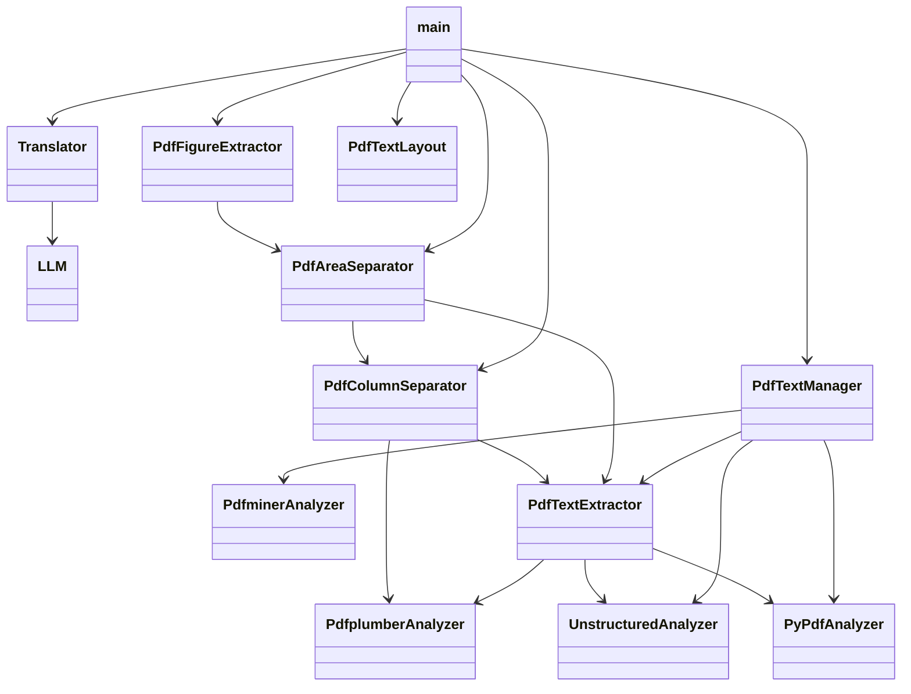

# TARDIS

PDF翻訳Webアプリ TARDIS（Translation And Reviewing Documents Interface Service）

## 概要

このアプリケーションは、ユーザーがアップロードしたPDFファイル（主に英語）を日本語に翻訳し、元のレイアウトを維持したまま新しいPDFファイルとして出力するWebアプリケーションです。翻訳にはllama.cppを利用したOpenAI互換APIを使用します。

## 機能

- PDFファイルのアップロード
- PDFからのテキスト、画像、図表の抽出と構造解析 (pdfminer.six)
- 翻訳単位の決定と結合
- 生成AI（llama.cpp）による日本語翻訳
- 元のレイアウトを維持したPDFの生成・出力 (pypdf, ReportLab)
- **PDFから図表のみを抽出したPDFの生成・出力** (pypdf, ReportLab)
    - **図表が検出されなかったページも白紙ページとして出力します。**
- PDFの段組みを検出し、境界線を描画したPDFの生成・出力
- ファイルサイズ制限、PDF形式エラー、ディスク容量不足、翻訳APIエラーなど、各種エラーハンドリング

## 技術スタック

- **バックエンド**: Python, Flask, Flask-SocketIO
- **PDF処理**: pdfminer.six, pypdf, ReportLab
- **翻訳API**: llama.cpp (OpenAI互換API)
- **フロントエンド**: HTML, CSS, JavaScript, Socket.IO
- **コンテナ化**: Docker, Docker Compose
- **テスト**: pytest

## ディレクトリ構成

```shell
tardis/
├── .gitignore                     # Git管理対象外ファイル
├── README.md                      # このドキュメント
├── AGENTS.md                      # コーディングアシスタント向けドキュメント
├── Dockerfile                     # Docker設定
├── app/
│   ├── __init__.py                # 空ファイル（パッケージ化）
│   ├── config.py                  # 設定ファイル
│   ├── data_model.py              # データモデル定義
│   ├── gen_sample_pdf.py          # サンプルPDF生成スクリプト
│   ├── llm.py                     # LLM連携モジュール
│   ├── main.py                    # メインアプリケーション
│   ├── pdf_area_separator.py      # テキスト領域分離モジュール
│   ├── pdf_column_separator.py    # 段組み分離モジュール
│   ├── pdf_figure_extractor.py    # 図表抽出モジュール
│   ├── pdf_text_extractor.py      # テキスト抽出モジュール
│   ├── pdf_text_layout.py         # 翻訳済みテキストのレイアウト計算と描画モジュール
│   ├── pdf_text_manager.py        # PDFテキスト管理モジュール
│   ├── text/                      # テキスト処理関連モジュール
│   │   ├── common.py              # 共通処理
│   │   ├── pdfminer.py            # pdfminer.sixによるテキスト抽出
│   │   ├── pdfplumber.py          # pdfplumberによるテキスト抽出
│   │   ├── pypdf.py               # pypdfによるテキスト抽出
│   │   └── unstructured.py        # unstructuredによるテキスト抽出
│   ├── translator.py              # 翻訳API連携モジュール
│   └── utils.py                   # ユーティリティ関数
├── docker-compose.yml             # Docker Compose設定
├── logs/                          # アプリケーションログ
├── outputs/                       # 翻訳済みファイル
├── requirements.txt               # 依存関係
├── scripts/                       # スクリプトファイル
├── static/
│   └── css/
│       └── style.css              # スタイルシート
├── templates/
│   └── index.html                 # フロントエンド（HTML）
├── tests/                         # テストコード
└── uploads/                       # アップロードされたファイル
```

## クラス構成



## セットアップと実行

### 前提条件

- Python 3.8+
- Docker
- Docker Compose
- llama.cpp (ローカル環境で実行)

### パッケージインストール

```shell
sudo apt update
sudo apt install ca-certificates curl apt-transport-https software-properties-common python3-venv

sudo install -m 0755 -d /etc/apt/keyrings
curl -fsSL https://download.docker.com/linux/ubuntu/gpg | sudo gpg --dearmor -o /etc/apt/keyrings/docker.gpg
sudo chmod a+r /etc/apt/keyrings/docker.gpg

echo \
  "deb [arch="$(dpkg --print-architecture)" signed-by=/etc/apt/keyrings/docker.gpg] https://download.docker.com/linux/ubuntu \
  "$(. /etc/os-release && echo "$VERSION_CODENAME")" stable" | \
  sudo tee /etc/apt/sources.list.d/docker.list > /dev/null

sudo apt update
sudo apt install docker-ce docker-ce-cli containerd.io docker-buildx-plugin docker-compose-plugin

python3 -m venv ~/tardis
source ~/tardis/bin/activate
python3 -m pip install -r requirements.txt
```

### 開発環境の起動

```shell
docker compose build
docker compose up -d
```

## エラーハンドリング

アプリケーションは、ファイルアップロード時（サイズ超過、拡張子不正）、PDF処理時（破損、解析エラー）、翻訳API通信時（タイムアウト、接続エラー、レート制限）など、様々なシナリオでエラーハンドリングを実装しています。エラーが発生した場合は、ユーザーに分かりやすいメッセージが表示されます。

## 実装の詳細

- **PDFテキスト管理**: `app/pdf_text_manager.py`
    - `pdfplumber`, `pypdf` など複数の抽出器をサポートし、PDFからテキストを抽出し、必要に応じて元のテキスト領域を削除します。
- **PDFテキストレイアウト**: `app/pdf_text_layout.py`
    - `ReportLab` を使用して、翻訳済みテキストのレイアウトを計算し、描画します。
- **段組み分離**: `app/pdf_column_separator.py` (エンドポイント `/column_separation`)
    - `pdfplumber` を使用してPDFのテキストブロックを解析し、段組みの境界を特定します。
    - `ReportLab` を使用して、特定された境界線を赤線で描画したPDFを生成します。
- **領域分離**: `app/pdf_area_separator.py` (エンドポイント `/area_separation`)
    - `pdfplumber` を使用してPDFのテキストブロック、図、表を解析し、それぞれの領域を色分けして描画したPDFを生成します。
- **テキスト抽出**: `app/pdf_text_extractor.py` (エンドポイント `/extract_text`)
    - `pdfplumber` を使用してPDFから単語単位でテキストを抽出し、隣接する単語を結合してテキストブロックを構成します。
    - `app/pdf_area_separator.py`と連携し、テキストブロックの結合ロジックを適用します。
    - `ReportLab` を使用して、各テキストブロックに番号を描画したPDFと、テキストブロックごとの文章を記載したtxtファイルを生成します。
- **翻訳**: `app/translator.py` (エンドポイント `/translate_text`)
    - `LLM`モジュールと連携し、テキストブロックごとのテキストを翻訳します。
    - 翻訳結果を元のテキストブロックの順序でtxtファイルに、各テキストブロックに番号も描画されたPDFファイルの2ファイルを出力します。
- **図表抽出**: `app/pdf_figure_extractor.py` (エンドポイント `/extract_figures`)
    - `pdfplumber`と`app/pdf_area_separator.py`で識別された図表領域を抽出し、`PIL (Pillow)` を使用して画像をPNG形式に変換します。
    - `ReportLab` を使用して図表のみのPDFを生成し、図表が検出されなかったページも白紙ページとして出力します。
- **翻訳文描画**: `app/pdf_text_layout.py` (エンドポイント `/draw_text`)
    - `ReportLab` を使用して、翻訳文を元のテキストブロックと同じ位置に描画したPDFを生成します。翻訳文の長さに応じてブロックの高さやフォントサイズを調整します。
- **PDF翻訳**: `main.py` (エンドポイント `/translate_pdf`)
    - 図表抽出と翻訳文描画の機能を組み合わせて、最終的な翻訳済みPDFを生成します。

## テスト

以下のコマンドを実行すると、テスト用のPDFファイル `uploads/sample.pdf` が作成されます。

```shell
python3 app/gen_sample_pdf.py
```

単体テストは `tests/` ディレクトリに配置されており、`pytest` を使用して実行できます。
ファイルアップロード時のエラーハンドリング（ファイルサイズ超過、拡張子不正、ディスク容量不足、PDF解析エラー）を網羅するテストスイートが作成されています。

テストを実行するには、以下のコマンドを使用してください。
```shell
. ~/tardis/bin/activate && PYTHONPATH=. && pytest
```

### API疎通テスト

OpenAI互換API経由で、LLMへアクセスが可能なのかは以下のコマンドでテストできます。

```shell
./scripts/check_api.bash
```

## 注意事項

- 翻訳APIはllama.cppを使用（ローカル環境のみがターゲット）
- ファイルサイズの上限は16MB
- 日本語フォントはIPAex明朝を使用
